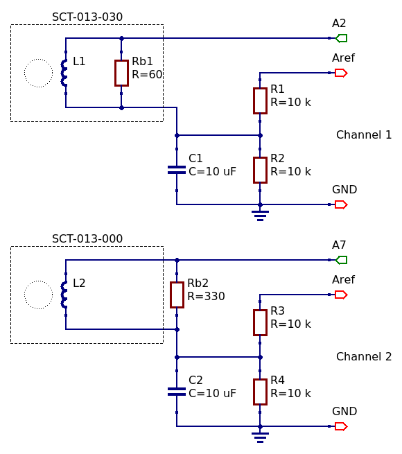

# Pràctica de sensorització

## Lectura de la intensitat eficaç del corrent elèctric amb els transductors SCT-013-000 i SCT-013-030 i la placa Arduino Nano 33 IoT 

| Alumne      | Lluís Bernat Ladaria  |
|---:         | --- |
| Assignatura | 11771 - Àrees d'aplicació d'IoT |
|             | MUSI - UIB  |
| Professor   | Dr. Bartomeu Alorda Ladaria |

---

## Introducció

En aquesta pràctica de sensorització disposam de dos transductors 
de la famíla SCT-013 que permeten mesurar la intensitat del corrent 
que circula per dins del seu cor magnètic. 
Aprofitant que l'SCT-013-000 no integra la resistència de càrrega, 
en calcularem una per tal de poder mesurar amb aquest, intensitats 
màximes de l'odre dels 7 A eficaços i així obtenir una major precisió a les 
lectures que la que ofereix el seu germà SCT-013-030. 
A canvi però haurem de perdre rang de mesura. 

Un microcontrolador Arduino fent servir la llibreria 
[MUSIEmonLib](https://github.com/llbernat/MUSIEmonLib.git) 
que hem desenvolupat ad-hoc per aquest projecte 
en prendrà les mesures de forma periòdica. 
Aquestes lectures es transmetran de forma segura cap a un servidor 
MQTT que és el punt d'entrada a un ecosistema 
Influxdb + Grafana que ens permetrà explotar aquestes dades. 

## Arquitectura

Ambdós transductors SCT-013 estan connectats de forma independent 
a una placa microcontrolada Arduino Nano 33 IoT per mitjà de dos 
senzills circuits que acondicionen el senyal. 
El sensor SCT-013-030 ja du integrada una resistència de càrrega de 60 Ohm 
que li permet generar 1 V a la seva sortida 
si detecta un corrent de 30 A. 
Per contra el sensor SCT-030-000 no té resistència de càrrega, 
així que amb aquest darrer gaudim de la llibertat de poder-ne 
ajustar la seva sensibilitat i precisió, tot canviant el valor de la 
nova resistència de càrrega que li afegirem al seu circuit 
d'acondicionament del senyal. 

El microcontrolador Arduino es connecta de forma segura 
(autenticació mútua amb mTLS) a un *broker* MQTT *Mosquitto* 
per tal de transmetre de forma encriptada 
els nivells de corrent mesurats periòdicament. 
Per a la realització del vídeo de la pràctica hem escollit un període 
de mostreig molt curt (10 segons) a fi de poder il·lustrar el funcionament 
durant el vídeo presentat. 
Evidentment pel cas general seria desitjable un període 
més llarg que podria ser entre 1 i 10 minuts depenent de la 
naturalesa del consum a mesurar i de les decisions a prendre. 

La solució presentada consta de vàries entitats de *software* i 
dels dos petits circuits electrònics d'acondicionament del 
senyal que passam a descriure breument: 

- [MUSIEmonLib](https://github.com/llbernat/MUSIEmonLib.git): 
llibreria que permet l'accés de lectura al sensor de corrent per tal d'estimar 
quin és el seu valor eficaç de corrent (*IRMS*). 
El codi de la llibreria està comentat i incorpora un exemple senzill.
Fa ús de la llibreria [EmonLib](https://github.com/openenergymonitor/EmonLib.git).

- [SensorCurrent.ino](SensorCurrent/SensorCurrent.ino): 
aquest és el cor de la pràctica. 
És l'encarregat de fer les cridades apropiades a la API MUSIEmonLib, 
i també de fer l'autenticació mútua, i encriptar el canal de 
comunicació amb el servidor MQTT.
Requereix que la placa Arduino disposi d'un xip AtmelECCx08 
(aquests xips ofereixen funcions d'encriptació), doncs 
la clau privada serà generada i custodiada per aquest xip 
i és el responsable de calcular les operacions de signatura que es fan amb aquesta clau.

- [Shape.ino](Shape/Shape.ino): 
petita utilitat que permet bolcar la forma de l'ona mostrejada cap a un servidor MQTT, 
per tal de poder-la visualitzar i efectuar controls visuals de qualitat 
del nostre montatge (bàsicament diagnóstic per mitjà de la forma de 
la ona mostrejada). 
Me va ser molt útil per entendre el perquè del renou als transductors.

- pki/: 
jerarquia de clau pública que dona suport a la part de comunicació segura mTLS. 
Dins el fitxer [PKI.md](PKI.md) hi ha les instruccions que s'han 
seguit per generar aquesta infraestructura.

- Circuit divisor de tensió + condensador de desacoblament: 
en aquest cas tenim dos circuits que generen una tensió d'aproximadament 
la meitat de la tensió que poden tractar els conversors ADC. 
Pel cas del Nano, són uns 1.65 Volts. 
Aquesta tensió serveix com a referència pel sensor de corrent, que es connecta 
per una banda a aquest punt mig i a la vegada a *GND* 
per mitjà d'un condensador de desacoblament (10 uF) i 
per l'altre cap a l'entrada de l'ADC. 
En el cas del transductor obert SCT-013-000 el circuit 
incorpora una resistència de càrrega calculada *ad-hoc*. 

### Càlcul de la resistència de càrrega de l'SCT-013-000

L'objectiu és mesurar intensitats de fins a 7 A (*RMS*). Per tant l'intensitat màxima serà: 

Ipeak = Irms * sqrt(2) = 7 * 1.41 = 9.9 A

Observant que el transductor és bàsicament 
un solenoide amb 2000 voltes de fil: 

Iinduïda = Ipeak / 2000 = 0.00495 A

I que el voltage màxim que podem mesurar amb un Arduino Nano 
amb aquest circuit divisor de tensió són Aref/2:

(Aref/2) / Iinduïda = 1.65 / 0.00495 = 333 Ohm 

Escollim el valor **330 Ohm** per ser el valor normalitzat 
just inferior. 

## Especificacions 

| | |
|---:|---|
|Número de canals:| 2|
|Sensibilitat Canal 1:| 30A (IRMS) / 1V (mínim detectable 0.9 A eficaços) |
|Canal 2:| 7A (IRMS) / 1V (mínim detectable 0.2 A eficaços) |
|Velocitat màx. de mostreig:| 1148 mostres / s / canal |
|Temps màxim d'entrenament del filtre DC:| 5000 ms / canal|
|Format del *payload*:|influxdb|
|Actualitzable *OTA*:|Sí. Cal compilar amb l'opció `OTA_UPDATES` habilitada. Definida a [wifi-secrets.h](wifi/wifi-secrets.h)

## Codis d'error

La placa senyalitza els següents errors modulant una cadència del LED integrat:

| Cadència LED | Descripció |
| :---: | --- |
| .-.-. | Aquesta placa no disposa d'un xip de serveis criptològics o està avariat. Sistema aturat |
| .-.-- | El xip d'encriptació no té gravada una configuració. Sistema aturat |
| .--.. | El xip WiFi no funciona o aquesta placa no en disposa. Sistema aturat |
| .--.- | Les credencials WiFi no permeten la connexió. Es reintentarà en breu |
| .---. | El servei d'obtenció de la data encara no està disponible. Es reintentarà en breu |
| .-.-- | El servidor MQTT no existeix o rebutja la connexió. Es reintentarà en breu |

## Dependències 

- [WiFiNINA](https://github.com/arduino-libraries/WiFiNINA.git) (>=1.8.8)
- [PubSubClient](https://github.com/knolleary/pubsubclient.git) (>=2.8.0)
- [BearSSLClient](https://github.com/arduino-libraries/ArduinoBearSSL.git) (>=1.7.0)
- [ArduinoECCX08](https://github.com/arduino-libraries/ArduinoECCX08.git) (>=1.3.5)
- [EmonLib](https://github.com/openenergymonitor/EmonLib.git) (>=1.1.0)
- [MUSIEmonLib](https://github.com:llbernat/MUSIEmonLib.git) (>=1.0.0)
- [ArduinoOTA](https://github.com/jandrassy/ArduinoOTA.git) (>=1.0.6 només en el cas de desitjar actualitzacions *OTA*)

Per tal de (re)generar el fitxer musi-ca.h que conté les *Trust Anchors* 
(veure el final de [PKI.md](PKI.md) per a més detall), 
cal: 

- Davallar la 
[utilitat pycert_bearssl](https://github.com/OPEnSLab-OSU/SSLClient/tree/master/tools/pycert_bearssl)
de la llibreria 
[SSLClient](https://github.com/OPEnSLab-OSU/SSLClient)

- I tenir un entorn Python3 amb les llibreries: 
  - click (`sudo pip install click`)
  - PyOpenSSL (`sudo pip install pyopenssl`)
  - certifi (`sudo pip install certifi`)
